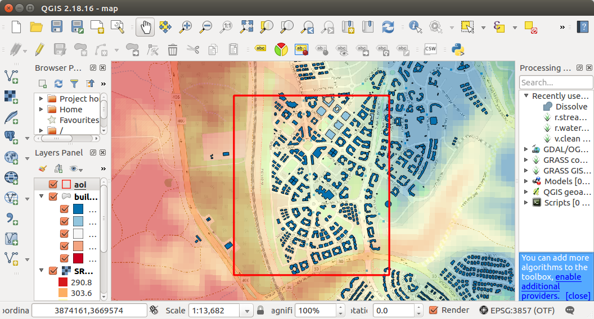
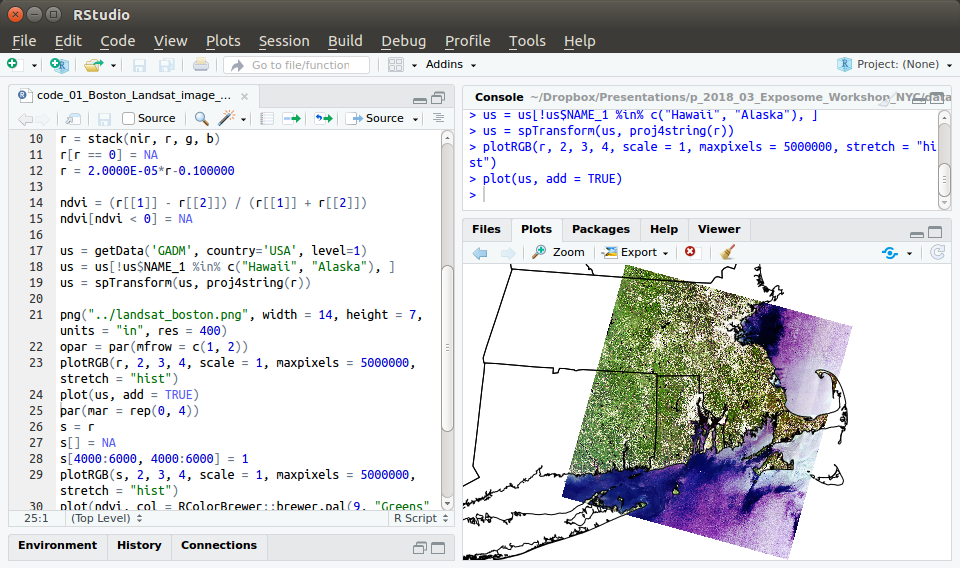
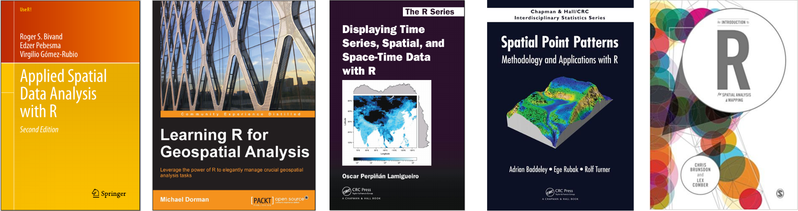
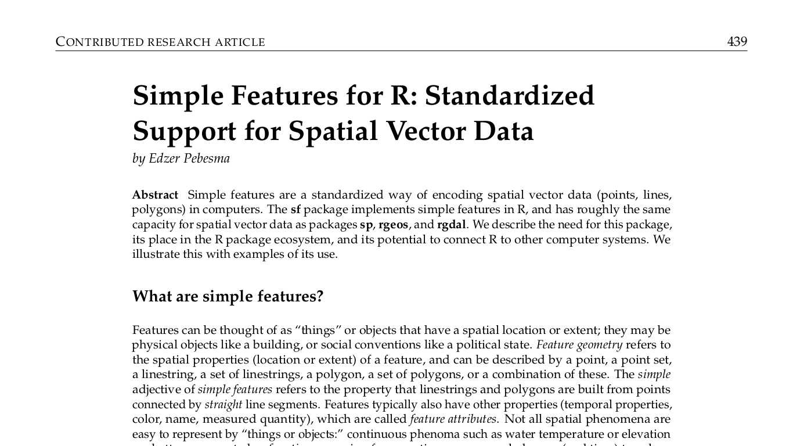
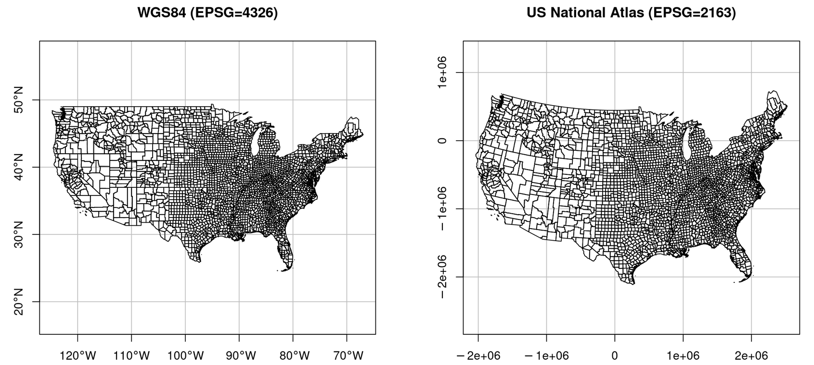
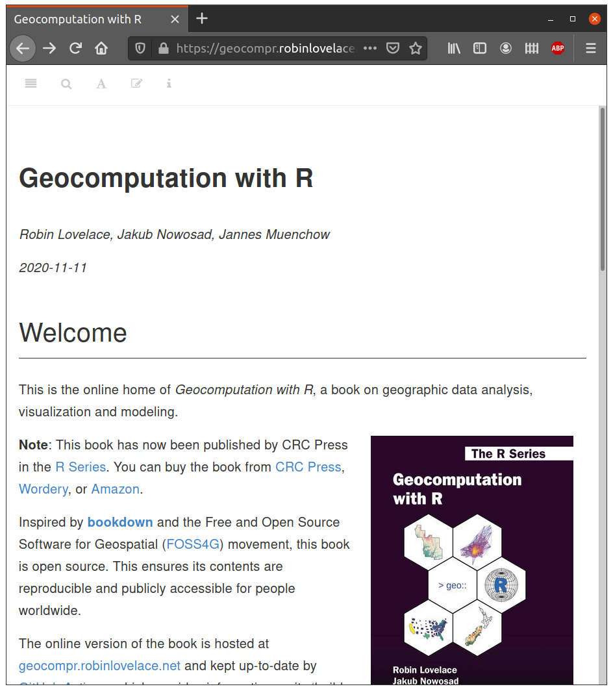
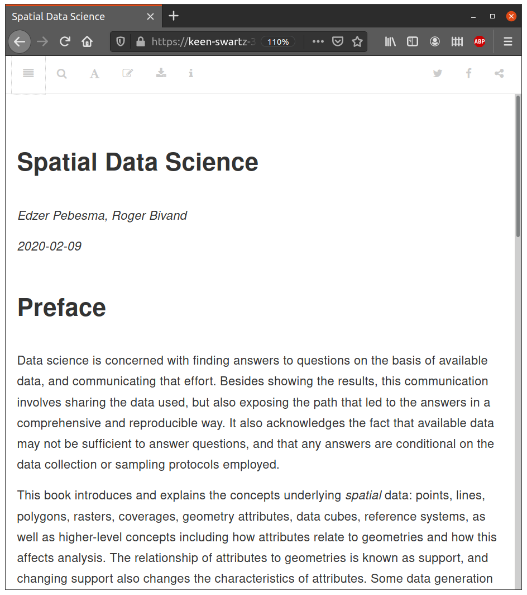
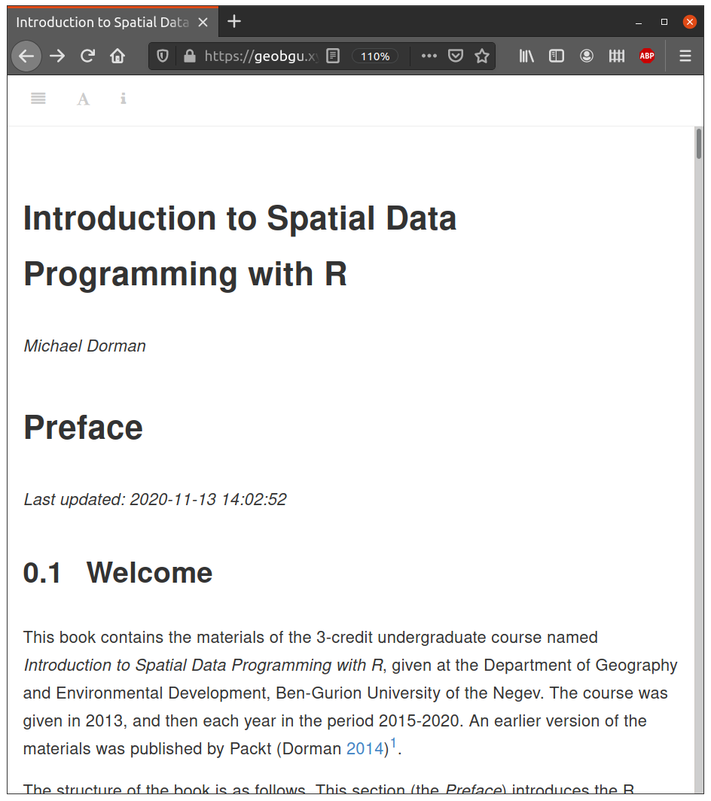
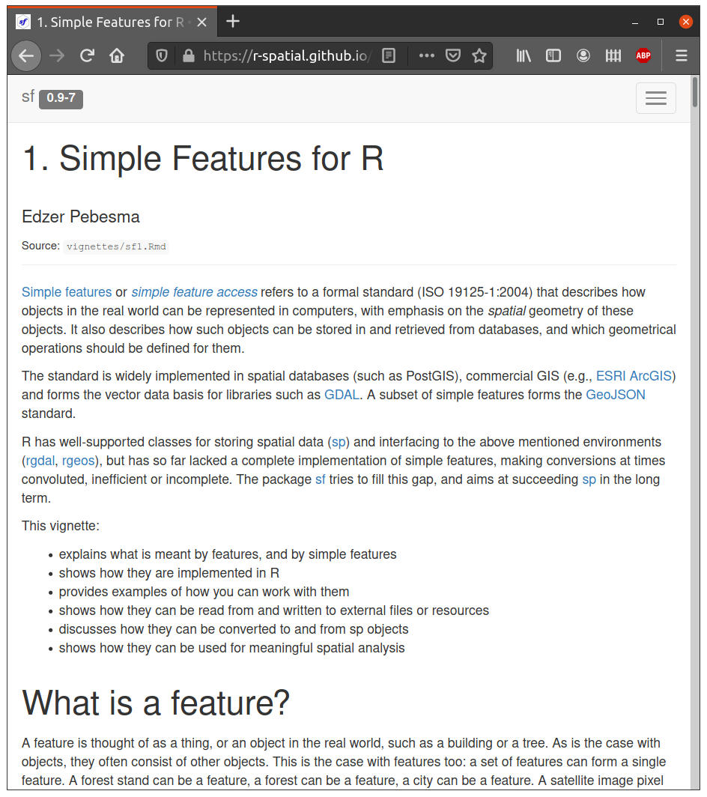

```{r setup, include=FALSE}
knitr::opts_chunk$set(cache = FALSE, echo = TRUE, collapse = TRUE, fig.align = "center")
# knitr::purl("main.Rmd", documentation = 1)
```

# Setup: sample data {-}

| Data | File(s) | Format | Source | 
|----|----|----|------|
| "Nafot"           | `nafot.shp` (+7)                      | Shapefile | https://www.gov.il/he/Departments/Guides/info-gis |
| Railways          | `RAIL_STRATEGIC.shp` (+7)             | Shapefile | https://data.gov.il/dataset/rail_strategic | 
| Statistical areas | `statisticalareas_demography2018.gdb` | GDB       | https://www.cbs.gov.il/he/Pages/geo-layers.aspx |

Table: (\#tab:sample-data) Sample data

The data and code for this lecture can be downloaded from:

https://github.com/michaeldorman/R-Spatial-Workshop-at-CBS-2021/raw/main/data.zip

A script with the R code of this document is available here:

https://github.com/michaeldorman/R-Spatial-Workshop-at-CBS-2021/raw/main/main.R

The Rmarkdown file is available here:

https://github.com/michaeldorman/R-Spatial-Workshop-at-CBS-2021/raw/main/preparation.Rmd

All of the materials are also available on [GitHub](https://github.com/michaeldorman/R-Spatial-Workshop-at-CBS-2021/).

For more details on setting up the environment and sample data, see the [preparation](preparation.html) document.

# R for Spatial Data Analysis

## Software for analysis of spatial data

Software in general, and software for sptial analysis in particular, is characterized by two types of interfaces:

* Graphical User Interface (GUI) (Figure \@ref(fig:gui))
* Command Line Interface (CLI) (Figure \@ref(fig:cli))

In a GUI, our interaction with the computer is restricted to the predefined set of input elements, such as buttons, menus, and dialog boxes. In a CLI, we interact with the computer by writing code, which means that our instructions are practically unconstraned. With a CLI, we can give the computer specific instructions to do anything we want. 

R, which we talk about today, is an example of CLI software for working with (among other things) spatial data.

```{r gui, echo=FALSE, fig.cap="**QGIS**, an example of Graphical User Interface (GUI) software", out.width="80%"}

```

```{r cli, echo=FALSE, fig.cap="**R**, an example of Command Line Interface (CLI) software", out.width="80%"}

```

## What is R?

**R** is a programming language and environment, originally developed for statistical computing and graphics. Notable advantages of R are that it is a full-featured programming language, yet customized for working with data, relatively simple and has a huge collection of ~16,000 packages in the [official repository](https://cran.r-project.org/web/packages/) from various areas of interest.Over time, there was an increasing number of contributed packages for handling and analyzing spatial data in R. Today, spatial analysis is a major functionality in R. As of October 2020, there are [~185 packages](https://cran.r-project.org/web/views/Spatial.html) specifically addressing spatial analysis in R, and many more are indirectly related to spatial data.

```{r, echo=FALSE, fig.cap="Books on Spatial Data Analysis with R", out.width="100%"}

```

## History of spatial analysis in R

Some important events in the history of spatial analysis support in R are summarized in Table \@ref(tab:r-history). 

| Year | Event |
|---|--------------|
| pre-2003 | Variable and incomplete approaches (`MASS`, `spatstat`, `maptools`, `geoR`, `splancs`, `gstat`, ...) |
| 2003 | Consensus that a package defining standard data structures should be useful; `rgdal` released on CRAN |
| 2005 | `sp` released on CRAN; `sp` support in `rgdal` |
| 2008 | *Applied Spatial Data Analysis with R*, 1^st^ ed. |
| 2010 | `raster` released on CRAN |
| 2011 | `rgeos` released on CRAN |
| 2013 | *Applied Spatial Data Analysis with R*, 2^nd^ ed. |
| 2016 | `sf` released on CRAN (Section \@ref(the-sf-package)) |
| 2018 | `stars` released on CRAN |
| 2019 | *Geocomputation with R* (https://geocompr.robinlovelace.net/) |
| 2021(?) | *Spatial Data Science* (https://www.r-spatial.org/book/) |

Table: (\#tab:r-history) Significant events in the history of R-spatial

## R as a GIS?

The question that arises here is: can R be used as a Geographic Information System (GIS), or as a comprehensive toolbox for doing spatial analysis? The answer is definitely *yes*. Moreover, R has some important advantages over traditional approaches to GIS, i.e., software with graphical user interfaces such as ArcGIS or QGIS. 

*General* advantages of Command Line Interface (CLI) software include:

* **Automation**—Doing otherwise unfeasible repetitive tasks
* **Reproducibility**—Precise control of instructions to the computer

Moreover, *specific* strengths of R as a GIS are:

* R capabilities in data **processing** and **visualization**, combined with dedicated **packages** for spatial data
* A **single environment** encompassing all analysis aspects—acquiring data, computation, statistics, visualization, Web, etc.

Nevertheless, there are situations when *other* tools are needed:

* **Interactive** editing or georeferencing (but see [`mapedit`](https://cran.r-project.org/package=mapedit) package)
* Unique GIS **algorithms** (3D analysis, label placement, splitting lines at intersections)
* Data that cannot fit in **RAM** (but R can connect to spatial databases^[https://cran.r-project.org/web/packages/sf/vignettes/sf2.html#reading_and_writing_directly_to_and_from_spatial_databases] and other softwere for working with big data)

The following sections (\@ref(input-and-output-of-spatial-data)--\@ref(rpostgresql-working-with-postgis)) highlight some of the capabilities of spatial data analysis packages in R, through short examples. 

## `sf` and `stars` {#input-and-output-of-spatial-data}

Reading spatial layers from a file into an R data structure, or writing the R data structure into a file, are handled by external libraries:

* [GDAL/OGR](https://gdal.org/) is used for **reading/writing** vector and raster files, with `sf` and `stars`
* [PROJ](https://proj.org/) is used for handling **Coordinate Reference Systems (CRS)**, in both `sf` and `stars`

## `sf`: Vector Layers

[GEOS](http://trac.osgeo.org/geos/) is used for geometric operations on *vector layers* with `sf`:

* **Numeric operators**---Area, Length, Distance...
* **Logical operators**---Contains, Within, Within distance, Crosses, Overlaps, Equals, Intersects, Disjoint, Touches...
* **Geometry generating operators**---Centroid, Buffer (Figure \@ref(fig:buffer)), Intersection, Union, Difference, Convex-Hull, Simplification...

```{r buffer, echo=FALSE, results="hide", message=FALSE, fig.cap="Buffer function", fig.width=6, fig.height=2.5, out.width="100%", warning=FALSE}
library(sf)
nafot = st_read("data/nafot.shp")
p = nafot[nafot$name_eng == "Be'er Sheva", ]
p = st_geometry(p)
opar = par(mfrow=c(1,4), mar = c(0, 0, 1, 0))

plot(p %>% st_buffer(100000), main = "10 km buffer", border = NA)
plot(p, add = TRUE)
plot(p %>% st_buffer(10000) %>% st_difference(p), col = "lightgrey", add = TRUE)

plot(p %>% st_buffer(100000), main = "25 km buffer", border = NA)
plot(p, add = TRUE)
plot(p %>% st_buffer(25000) %>% st_difference(p), col = "lightgrey", add = TRUE)

plot(p %>% st_buffer(100000), main = "50 km buffer", border = NA)
plot(p, add = TRUE)
plot(p %>% st_buffer(50000) %>% st_difference(p), col = "lightgrey", add = TRUE)

plot(p %>% st_buffer(100000), main = "100 km buffer")
plot(p, add = TRUE)
plot(p %>% st_buffer(100000) %>% st_difference(p), col = "lightgrey", add = TRUE)

par(opar)
```

## `stars`: Rasters

Geometric operations on *rasters* can be done with package `stars`:

* **Accessing cell values**---As matrix / array, Extracting to points / lines / polygons
* **Raster algebra**---Arithmetic (`+`, `-`, ...), Math (`sqrt`, `log10`, ...), logical (`!`, `==`, `>`, ...), summary (`mean`, `max`, ...), Masking
* **Changing resolution and extent**---Cropping, Mosaic, Resampling, Reprojection
* **Transformations**---Raster <-> Points / Contour lines / Polygons

## `gstat`: Interpolation

Univariate and multivariate geostatistics:

* Variogram modelling 
* Ordinary and universal point or block (co)kriging (Figure \@ref(fig:gstat))
* Cross-validation

```{r gstat, echo=FALSE, results="hide", message=FALSE, fig.cap="Predicted Zinc concentration, using Ordinary Kriging", out.width="70%"}
library(gstat)
library(automap)
library(stars)

# Prepare data
data(meuse)
data(meuse.riv)
coordinates(meuse) = ~ x + y
data(meuse.grid)
gridded(meuse.grid) = ~ x + y
grid = st_as_stars(meuse.grid)

# Predict
f = log(zinc) ~ 1
v = autofitVariogram(f, meuse)
g = gstat(formula = log(zinc) ~ 1, model = v$var_model, data = meuse)
predicted = predict(g, grid)

# River color
col = col2rgb("lightblue")
col = col / 255
col = rgb(col[1], col[2], col[3], 0.5)

# Plot
plot(predicted, col = rev(hcl.colors(11, "Spectral")), reset = FALSE, key.pos = 4, main = NA)
polygon(meuse.riv, asp = 1, col = col)
plot(meuse, pch = 1, cex = log(meuse$zinc) / 5, add = TRUE)
```

## `spdep`: Spatial dependence

Modelling with spatial weights:

* Building neighbor lists (Figure \@ref(fig:spdep)) and spatial weights
* Tests for spatial autocorrelation for areal data (e.g. Moran's I)
* Spatial regression models (e.g. SAR, CAR)

```{r spdep, echo=FALSE, results="hide", message=FALSE, warning=FALSE, fig.cap="Neighbors list based on regions with contiguous boundaries", fig.width=7, fig.height=3.5, out.width="100%"}
# From '?poly2nb'
library(spdep)
nc = st_read(system.file("shape/nc.shp", package = "sf"))
nc = as(nc, "Spatial")
nc$rate = nc$SID79 / nc$BIR79
nb = poly2nb(nc)
opar = par(mar = rep(0, 4))
plot(nc, border = "grey")
plot(nb, coordinates(nc), add = TRUE, col = "black")
par(opar)
```

## `spatstat`: Point patterns

Techniques for statistical analysis of spatial point patterns (Figure \@ref(fig:spatstat)), such as:

* Kernel density estimation
* Detection of clustering using Ripley's K-function 
* Spatial logistic regression
    
```{r spatstat, echo=FALSE, results="hide", message=FALSE, warning=FALSE, fig.cap="Distance map for the Biological Cells point pattern dataset", fig.width=4, fig.height=4, out.width="50%"}
library(spatstat)
data(cells)
U = distmap(cells)
opar = par(mar = rep(0, 4))
contour(U, main = "")
plot(cells, add = TRUE, col = "red", pch = 3)
par(opar)
```

## `RPostgreSQL`: PostGIS {#rpostgresql-working-with-postgis}

Package `sf` combined with `RPostgreSQL` can be used to read from, and write to, a **PostGIS** spatial database:

```{r, eval=FALSE}
# library(sf)
# library(RPostgreSQL)

# con = dbConnect(
#   PostgreSQL(),
#   dbname = "gisdb",
#   host = "159.89.13.241",
#   port = 5432,
#   user = "geobgu",
#   password = "*******"
# )
```

```{r, eval=FALSE}
# q = "SELECT name_lat, geometry FROM plants LIMIT 3;"
# st_read(con, query = q)
```

```{r, echo=FALSE}
# library(sf)
# source("/home/michael/Sync/postgis_159.R")
# q = "SELECT name_lat, geometry FROM plants LIMIT 3;"
# st_read(con, query = q)
```

```{r, include=FALSE}
# dbDisconnect(con)
```

## Other examples

* Network routing: `stplanr`, `dodgr`, `sfnetworks`, `igraph`
* Simplification `rmapshaper`
* Access to OSM data: `osmdata`, `osmextract`
* Static mapping: `ggplot2`, `tmap`, `rasterVis`
* Web mapping: `leaflet`, `mapview`, `deckgl`
* Mapping APIs: `mapsapi`
* Spherical geometry: `geosphere`, `s2`, `lwgeom`

# Spatial data structures

## The `sf` package {#the-sf-package}

The `sf` package (Figure \@ref(fig:sf-r-journal)), released in 2016, is a newer package for working with vector layers in R, which we are going to use in this book. In recent years, `sf` has become the standard package for working with vector data in R, practically replacing `sp`, `rgdal`, and `rgeos`. 

```{r sf-r-journal, echo=FALSE, fig.cap="Pebesma, 2018, The R Journal (https://journal.r-project.org/archive/2018-1/)", out.width="100%"}

```

One of the important innovations in `sf` is a complete implementation of the [**Simple Features**](https://cran.r-project.org/web/packages/sf/vignettes/sf1.html) standard. Since 2003, Simple Features been widely implemented in **spatial databases** (such as **PostGIS**), commercial GIS (e.g., **ESRI ArcGIS**) and forms the vector data basis for libraries such as **GDAL**. The Simple Features standard defines several types of geometries, of which seven are most commonly used in the world of GIS and spatial data analysis (Figure \@ref(fig:geometry-types)). When working with spatial databases, Simple Features are commonly specified as [**Well Known Text (WKT)**](https://en.wikipedia.org/wiki/Well-known_text). A subset of simple features forms the [**GeoJSON**](https://en.wikipedia.org/wiki/GeoJSON) standard.

```{r geometry-types, echo=FALSE, fig.cap="Simple Feature types (see also: https://r-spatial.github.io/sf/articles/sf1.html)", fig.width=6.8, fig.height=4, out.width="80%", warning=FALSE, message=FALSE}
library(sf)
library(units)
point = st_as_sfc("POINT (30 10)")[[1]]
linestring = st_as_sfc("LINESTRING (30 10, 10 30, 40 40)")[[1]]
polygon = st_as_sfc("POLYGON ((35 10, 45 45, 15 40, 10 20, 35 10),(20 30, 35 35, 30 20, 20 30))")[[1]]
multipoint = st_as_sfc("MULTIPOINT ((10 40), (40 30), (20 20), (30 10))")[[1]]
multilinestring = st_as_sfc("MULTILINESTRING ((10 10, 20 20, 10 40),(40 40, 30 30, 40 20, 30 10))")[[1]]
multipolygon = st_as_sfc("MULTIPOLYGON (((40 40, 20 45, 45 30, 40 40)),((20 35, 10 30, 10 10, 30 5, 45 20, 20 35),(30 20, 20 15, 20 25, 30 20)))")[[1]]
geometrycollection = st_as_sfc("GEOMETRYCOLLECTION (POLYGON((30 20, 45 40, 10 40, 30 20)),LINESTRING (10 10, 20 20, 10 30),POINT (40 20))")[[1]]
pol = st_as_sfc("POLYGON((30 20, 45 40, 10 40, 30 20))")[[1]]
l = st_as_sfc("LINESTRING (10 10, 20 20, 10 30)")[[1]]
p = st_as_sfc("POINT (40 20)")[[1]]
opar = par(mfrow = c(2, 4), mar = c(1,1,1,1))
plot(point, main = "POINT", col = "blue", cex = 1.8, lwd = 2)
plot(linestring, main = "LINESTRING", col = "blue", lwd = 2)
plot(polygon, main = "POLYGON", border = "blue", col = "#0000FF33", lwd = 2)
plot(1, type="n", axes=F, xlab="", ylab="")
plot(multipoint, main = "MULTIPOINT", col = "blue", cex = 1.8, lwd = 2)
plot(multilinestring, main = "MULTILINESTRING", col = "blue", lwd = 2)
plot(multipolygon, main = "MULTIPOLYGON", border = "blue", col = "#0000FF33", lwd = 2)
plot(geometrycollection, main = "GEOMETRYCOLLECTION", col = NA, border = NA, lwd = 2)
plot(pol, border = "blue", col = "#0000FF33", add = TRUE, lwd = 2)
plot(l, col = "blue", add = TRUE, lwd = 2)
plot(p, col = "blue", add = TRUE, cex = 1.8, lwd = 2)
par(opar)
```

The `sf` package depends on several external software components (installed along with the R package^[in Windows.]), most importantly **GDAL**, **GEOS** and **PROJ** (Figure \@ref(fig:sf-dependencies)). These well-tested and popular open-source components are common to numerous open-source and commercial software for spatial analysis, such as **QGIS** and **PostGIS**.

```{r sf-dependencies, echo=FALSE, fig.cap="`sf` package dependencies (https://github.com/edzer/rstudio_conf)", out.width="100%"}
knitr::include_graphics("images/sf_deps.png")
```

## `sf` data structures {#sf-data-structures}

Package `sf` defines a *hierarchical* class system with three classes (Table \@ref(tab:structures-package-sf)):

* Class `sfg`---a *single* geometry
* Class `sfc`---a geometry column, which is a *set* of `sfg` geometries + CRS information
* Class `sf`---a layer, which is an `sfc` geometry column inside a `data.frame` with non-spatial *attributes*

| Class | Hierarchy | Information |
|---|---|---|
| `sfg` | Geometry | type, coordinates | 
| `sfc` | Geometry column | set of `sfg` + CRS | 
| `sf` | Layer | `sfc` + attributes | 

Table: (\#tab:structures-package-sf) Spatial data structures in package `sf`

The `sf` class represents a vector layer by extending the `data.frame` class, supplementing it with a **geometry column**. This is similar to the way that spatial databases are structured. For example, the sample dataset shown in Figure \@ref(fig:nc-geometry-column) represents a polygonal layer with three features and six non-spatial attributes. The attributes refer to demographic and epidemiological attributes of US counties, such as the number of births in 1974 (`BIR74`), the number of sudden infant death cases in 1974 (`SID74`), and so on. The seventh column is the *geometry column*, containing the polygon geometries. 

```{r nc-geometry-column, echo=FALSE, fig.cap="Structure of an `sf` object (https://cran.r-project.org/web/packages/sf/vignettes/sf1.html)", out.width="100%"}
knitr::include_graphics("images/sf.png")
```

Figure \@ref(fig:nc-plot) shows what the layer in Figure \@ref(fig:nc-geometry-column) would look like when *mapped*. We can see the outline of the three polygons, as well as the values of all six non-spatial attributes (in separate panels). 

```{r nc-plot, echo=FALSE, message=FALSE, warning=FALSE, fig.cap="Visualization of the `sf` object shown in Figure \\@ref(fig:nc-geometry-column)", out.width="100%", fig.width=8, fig.height=3}
library(sf)
nc = st_read(system.file("shape/nc.shp", package = "sf"), quiet = TRUE)
nc = nc[1:3, 9:15]

library(ggplot2)
nc$id = 1:nrow(nc)
nc1 = reshape2::melt(st_drop_geometry(nc), id.vars = "id")
nc1 = merge(nc1, nc, all.x = TRUE)
nc1 = st_sf(nc1)
ctr = st_centroid(nc1)
ctr$x = st_coordinates(ctr)[, 1]
ctr$y = st_coordinates(ctr)[, 2]

opar = par(mar = rep(0, 4))
ggplot() +
  geom_sf(data = nc1) +
  geom_text(data = ctr, aes(x = x, y = y, label = value)) +
  facet_wrap(~ variable) +
  theme_bw() +
  theme(
    axis.title = element_blank(),
    axis.text = element_blank(),
    axis.ticks = element_blank(),
    strip.background = element_blank(),
    panel.border = element_blank(),
    panel.grid.major = element_line(colour = 'transparent')
  )
par(opar)
```

```{r, include=FALSE}
lapply(names(sessionInfo()$loadedOnly), require, character.only = TRUE)
invisible(lapply(paste0('package:', names(sessionInfo()$otherPkgs)), detach, character.only=TRUE, unload=TRUE, force=TRUE))
```

## Reading vector data

Function `st_read` can be used to read vector layers into `sf` data structures:

```{r}
library(sf)
```

```{r}
nafot = st_read("data/nafot.shp")
```

Printing the object gives a summary of its properties, and the values of the (first 10) features:

```{r}
nafot
```

As mentioned above, a layer (geometry+attributes) is represented by an `sf` object:

```{r}
class(nafot)
```

If we want just the *geometric* part, it can be extracted with `st_geometry`, resulting in an object of class `sfc` (geometry column):

```{r}
st_geometry(nafot)
```

Conversely, If we want just the *non-geometric* part, it can be extracted with `st_drop_geometry`, resulting in a `data.frame`:

```{r}
st_drop_geometry(nafot)
```

The `plot` function is a quick way to see the spatial arrangment and attribute values in an `sf` layer. For example, the `nafot` layer attribute can be plotted as follows (Figure \@ref(fig:simple-plot)):

```{r simple-plot, fig.cap="The `nafot` layer", fig.width=4, fig.height=6, out.width="50%"}
plot(nafot, key.width = lcm(4))
```

Alternatively, we can plot the geometry only, without attributes, as follows (Figure \@ref(fig:simple-plot-geometry)):

```{r, eval=FALSE}
plot(st_geometry(nafot))
```

```{r simple-plot-geometry, echo=FALSE, fig.cap="The `nafot` layer", fig.width=4, fig.height=6, out.width="50%"}
opar = par(mar = rep(0, 4))
plot(st_geometry(nafot))
par(opar)
```

## Coordinate Reference Systems (CRS)

### What are CRS?

A **Coordinate Reference System (CRS)** defines how the coordinates in our geometries relate to the surface of the Earth. There are two main types of CRS:

* **Geographic**---longitude and latitude, in degrees
* **Projected**---implying flat surface, usually in units of true distance (e.g., meters)

For example, Figure \@ref(fig:geographic-vs-projected) shows the same polygonal layer (U.S. counties) in two different projection. On the left, the county layer is in the WGS84 geographic projection. Indeed, we can see that the axes are given in degrees of longitude and latitude. For example, we can see how the nothern border of U.S. follows the 49° latitude line. On the right, the same layer is displayed in the US National Atlas projection, where units are arbitrary but reflect true distance (meters). For example, the distance between every two consecutive grid lines is 1,000,000 meters or 1,000 kilometers.

```{r geographic-vs-projected, echo=FALSE, fig.cap="US counties in WGS84 and US Atlas projections", out.width="100%"}

```

The CRS of a given `sf` layer can be obtained using function `st_crs`. The CRS information is returned in the WKT format:

```{r}
st_crs(nafot)
```

### Vector layer reprojection {#vector-layer-reprojection}

**Reprojection** is the transformation of geometry coordinates, from one CRS to another. It is an important part of spatial analysis workflow since as we often need to:
    
* Transform several layers into the same projection, so that they can be displayed one on top of the other (e.g., Figure \@ref(fig:nafot-rail)) or so that they can be subject to a spatial operator (e.g., Figure \@ref(fig:geometry-generating-pairs))
* Switch between un-projected and projected CRS

A vector layer can be reprojected with `st_transform`. The `st_transform` function has two important parameters: 

* `x`---The layer to be reprojected
* `crs`---The *target* CRS

The `crs` can be specified in one of four ways:

* An **EPSG** code (e.g., `4326`)
* A **PROJ4** string (e.g., `"+proj=longlat +datum=WGS84 +no_defs"`)
* A **WKT** string
* A `crs` object of another layer, as returned by `st_crs`

For example, the following expression reprojects the `nafot` layer to the geographic WGS84 CRS, using its EPSG code (`4326`):

```{r}
nafot_wgs84 = st_transform(nafot, 4326)
nafot_wgs84
```

```{r, fig.cap="Nafot in UTM and WGS84 coordinate reference systems", fig.height=7, fig.width=4.5, out.width="40%", fig.show="hold"}
plot(st_geometry(nafot), main = "UTM", axes = TRUE)
plot(st_geometry(nafot_wgs84), main = "WGS84", axes = TRUE)
```

# Geoprocessing functions

## Reading layers into R

For the next series of examples, we read a second layer `RAIL_STRATEGIC.shp`. The layer contains Railways lines in Israel. Using `st_read`, we import the layer and create an `sf` object called `rail`:

```{r}
rail = st_read("data/RAIL_STRATEGIC.shp")
```

Here is a summary of the `rail` layer:

```{r}
rail
```

## Reprojection

For any type of spatial analysis, we usually need all input layers to be in the same CRS. For that purpose, we will reproject the `rail` layer to the CRS of the `nafot` layer:

```{r}
rail = st_transform(rail, st_crs(nafot))
```

## Basic plotting

We can plot the `rail` layer on its own, as shown in Figure \@ref(fig:plot-rail), to examine its attributes:

```{r plot-rail, fig.cap="The `rail` layer", fig.width=6, fig.height=4, out.width="100%", warning=FALSE}
plot(rail)
```

We can also plot the `nafot` and `rail` geometries together, to examine their arrangement (Figure \@ref(fig:nafot-rail)). The second expression uses `add=TRUE` to add the geometries on top of the existing plot, instead of initializing a new one:

```{r, eval=FALSE}
plot(st_geometry(nafot), border = "grey")
plot(st_geometry(rail), add = TRUE)
```

```{r nafot-rail, echo=FALSE, fig.cap="The `nafot` and `rail` geometries", fig.width=4, fig.height=6, out.width="50%", warning=FALSE}
opar = par(mar = rep(0, 4))
plot(st_geometry(nafot), border = "grey")
plot(st_geometry(rail), add = TRUE)
par(opar)
```

## Subsetting

### Non-spatial

Subsetting (filtering) of features in an `sf` vector layer is done in exactly the same way as filtering rows in a `data.frame`. For example, the following expression filters the `rail` layer to keep only those railway lines which are active: 

```{r}
rail = rail[rail$ISACTIVE == "פעיל", ]
rail
```

We can also subset the columns (attributes) we need. For example, in the following expressions we create an ID attribute called `segment_id`, and remove all other attributes:

```{r}
rail$segment_id = 1:nrow(rail)
rail = rail["segment_id"]
rail
```

### Spatial

We can also subset feature according to intersection with another layer, using the latter as an index. For example, the following expression creates a subset of `nafot`, named `nafot1`, with only those features intersecting the `rail` layer:

```{r}
nafot1 = nafot[rail, ]
nafot1
```

Figure \@ref(fig:nafot-subset) shows the nafot subset (in grey fill) and the railway lines layer. 

```{r, eval=FALSE}
plot(st_geometry(nafot), border = "grey50")
plot(st_geometry(nafot1), border = "grey50", col = "grey90", add = TRUE)
plot(st_geometry(rail), add = TRUE)
```

```{r nafot-subset, echo=FALSE, fig.cap="The `nafot` and `rail` geometries", fig.width=4, fig.height=6, out.width="50%", warning=FALSE}
opar = par(mar = rep(0, 4))
plot(st_geometry(nafot), border = "grey50")
plot(st_geometry(nafot1), border = "grey50", col = "grey90", add = TRUE)
plot(st_geometry(rail), add = TRUE)
par(opar)
```

## Geometric calculations

Geometric operations on vector layers can conceptually be divided into three groups according to their output:

* **Numeric** values (Section \@ref(numeric-geometric-calculations))---Functions that summarize geometrical properties of:
    * A *single* layer---e.g., area, length
    * A *pair* of layers---e.g., distance
* **Logical** values (Section \@ref(logical-geometric-calculations))---Functions that evaluate whether a certain condition holds true, regarding:
    * A *single* layer---e.g., geometry is valid
    * A *pair* of layers---e.g., feature A intersects feature B
* **Spatial** layers (Section \@ref(spatial-geometric-calculations))---Functions that create a new layer based on:
    * A *single* layer---e.g., centroid, buffer
    * A *pair* of layers---e.g., intersection area

### Numeric {#numeric-geometric-calculations}

There are several functions to calculate *numeric* geometric properties of vector layers in package `sf`:

* `st_length`
* `st_area`
* `st_distance`
* `st_bbox`
* `st_dimension`

For example, we can calculate the area of each feature in the `nafot` layer (i.e. each state) using `st_area`:

```{r}
nafot$area = st_area(nafot)
nafot$area[1:3]
```

The result is an object of class `units`:

```{r}
class(nafot$area)
```

We can convert measurements to different units with `set_units` from package `units`:

```{r}
library(units)
nafot$area = set_units(nafot$area, "km^2")
nafot$area[1:3]
```

Inspecting the result:

```{r, fig.cap="Calculated `area` attribute", fig.width=4, fig.height=6, out.width="50%"}
plot(nafot[, "area"])
```

### Logical {#logical-geometric-calculations}

Given two layers, `x` and `y`, the following *logical* geometric functions check whether each feature in `x` maintains the specified relation with each feature in `y`:

* `st_intersects`
* `st_disjoint`
* `st_touches`
* `st_crosses`
* `st_within`
* `st_contains`
* `st_overlaps`
* `st_covers`
* `st_covered_by`
* `st_equals`
* `st_equals_exact`

When specifying `sparse=FALSE` the functions return a logical `matrix`. Each element `i,j` in the `matrix` is `TRUE` when `f(x[i], y[j])` is `TRUE`. For example, this creates a matrix of *intersection* relations between nafot:

```{r}
int = st_intersects(nafot1, nafot1, sparse = FALSE)
```

```{r}
int
```

The following code section visualizes the `matrix`:

```{r, fig.cap="Intersection relations between `nafot` features", out.width="80%"}
int1 = apply(int, 2, rev)
int1 = t(int1)
image(int1, col = c("lightgrey", "red"), asp = 1, axes = FALSE)
axis(3, at = seq(0, 1, 1/(nrow(int1)-1)), labels = nafot1$name_eng, las = 2, lwd = 0, lwd.ticks = 1, cex.axis = 0.75)
axis(2, at = seq(0, 1, 1/(nrow(int1)-1)), labels = rev(nafot1$name_eng), las = 1, pos = -0.046, lwd = 0, lwd.ticks = 1, cex.axis = 0.75)
```

### Spatial {#spatial-geometric-calculations}

`sf` provides common *geometry-generating* functions applicable to individual geometries, such as:

* `st_centroid`
* `st_buffer`
* `st_sample`
* `st_convex_hull`
* `st_voronoi`

```{r, echo=FALSE, fig.cap="Geometry-generating operations on individual layers", fig.height=4, fig.width=6, out.width="100%"}
set.seed(1)
x = st_multipoint(matrix(runif(10), ncol = 2))
x = st_buffer(st_sfc(lapply(1:3, function(x) st_point(c(x,x)))), 0.2 * 1:3)
opar = par(mfrow=c(2,3), mar = rep(1,4))
plot(x, border = '#ff333388')
plot(st_centroid(x), add = TRUE, pch = 3)
title("st_centroid")
plot(x, border = '#ff333388')
plot(st_buffer(x, dist = 0.1), add = TRUE, pch = 3)
plot(st_buffer(x, dist = 0.2), add = TRUE, pch = 3)
plot(st_buffer(x, dist = 0.3), add = TRUE, pch = 3)
plot(st_buffer(x, dist = 0.4), add = TRUE, pch = 3)
plot(st_buffer(x, dist = 0.5), add = TRUE, pch = 3)
title("st_buffer")
s = split(x, 1:3)
s = lapply(s, st_sample, size = 5)
s = lapply(s, st_combine)
s = do.call(c, s)
plot(x, border = '#ff333388')
plot(s, add = TRUE, pch = 3)
title("st_sample")
plot(s, col = '#ff333388', pch = 3)
plot(st_convex_hull(s), add = TRUE, pch = 3)
title("st_convex_hull")
s = st_union(s)
v = st_voronoi(s)
plot(s, col = '#ff333388', pch = 3)
plot(v, col = NA, border = 1, axes = FALSE, add = TRUE)
title("st_voronoi")
par(opar)
```

For example, the following expression uses `st_centroid` to create a layer of "Nafa" centroids:

```{r, warning=FALSE}
nafot_ctr = st_centroid(nafot)
```

They can be plotted as follows, the result is shown in Figure \@ref(fig:nafot-ctr):

```{r, eval=FALSE}
plot(st_geometry(nafot), border = "grey")
plot(st_geometry(nafot_ctr), col = "red", pch = 3, add = TRUE)
```

```{r nafot-ctr, echo=FALSE, fig.cap="State centroids", fig.width=4, fig.height=6, out.width="50%", warning=FALSE}
opar = par(mar = rep(0, 4))
plot(st_geometry(nafot), border = "grey")
plot(st_geometry(nafot_ctr), col = "red", pch = 3, add = TRUE)
par(opar)
```

Other geometry-generating functions work on *pairs* of input geometries (Figure \@ref(fig:geometry-generating-pairs)):

* `st_intersection`
* `st_difference`
* `st_sym_difference`
* `st_union`

```{r geometry-generating-pairs, echo=FALSE, fig.cap="Geometry-generating operations on pairs of layers", fig.height = 3.5, fig.width = 6, out.width="80%"}
x = st_point(c(0, 0))
x = st_buffer(x, 0.5)
y = st_point(c(0.5, 0))
y = st_buffer(y, 0.5)

xy = c(x, y)

opar = par(mfrow=c(2,3), mar = rep(1,4))

plot(xy, border = NA)
plot(x, add = TRUE, col = "#ff333388")
plot(y, add = TRUE, col = "#33ff3388")
title("x: red, y: green")

plot(xy, border = "grey")
plot(st_intersection(x, y), col = "lightblue", add = TRUE)
title("intersection(x, y)")

plot(xy, border = "grey")
plot(st_difference(x, y), col = "lightblue", add = TRUE)
title("difference(x, y)")

plot(xy, border = NA)

plot(xy, border = "grey")
plot(st_sym_difference(x, y), col = "lightblue", add = TRUE)
title("sym_difference(x, y)")

plot(xy, border = "grey")
plot(st_union(x, y), col = "lightblue", add = TRUE)
title("union(x, y)")

par(opar)
```

# Example #1: Rail density

## Splitting lines by polygons

For example, to calculate total rail length per "Nafa" we can use `st_intersection` to 'split' the `rail` layer by "Nafa":

```{r, message=FALSE, warning=FALSE}
rail_int = st_intersection(rail, nafot)
rail_int
```

The result is a new line layer split by "Nafa" borders and including the `name_eng` attribute:

```{r, fig.cap="Intersection result", fig.width=4, fig.height=6, out.width="50%", warning=FALSE}
plot(rail_int[, "name_eng"], lwd = 3, key.width = lcm(4), reset = FALSE)
plot(st_geometry(nafot), border = "lightgrey", add = TRUE)
```

## Line length

The resulting layer has mixed `LINESTERING` and `MULTILINESTRING` geometries (Why?)

```{r}
class(rail_int$geometry)
```

To calculate line length, we need to convert it to `MULTILINESTRING`:

```{r}
rail_int = st_cast(rail_int, "MULTILINESTRING")
rail_int
```

Let's add a **railway length** attribute called `length`:

```{r}
rail_int$length = st_length(rail_int)
rail_int$length = set_units(rail_int$length, km)
rail_int
```

## Join layer with table

Next we aggregate attribute table of `rail_int` by `state`, to find the sum of `length` values:

```{r, message=FALSE}
rail_int = st_drop_geometry(rail_int) 
rail_int = aggregate(rail_int["length"], rail_int["name_eng"], sum)
```

The result is a `data.frame` with total length of railway tracks, per "Nafa":

```{r}
head(rail_int)
```

Next, we can *join* the aggregated table back to the `nafot` layer:

```{r}
nafot = merge(nafot, rail_int, by = "name_eng", all.x = TRUE)
```

Here is how the `nafot` layer looks like after the join:

```{r}
nafot
```

Length of `NA` implies there are no railways in the polygon. These `NA` values should therefore be replaced with zero:

```{r}
nafot$length[is.na(nafot$length)] = 0
```

```{r, fig.cap="Total railway length per Nafa", out.width="50%", warning=FALSE, fig.width=4, fig.height=6}
plot(nafot[, "length"])
```

## Calculating density

Finally, we divide total railway length by state area. This gives us railway **density** per state:

```{r}
nafot$density = nafot$length / nafot$area
```

Sorted:

```{r}
nafot = nafot[order(nafot$density, decreasing = TRUE), ]
nafot
```

Plotting the layer shows the new `density` attribute (Figures \@ref(fig:density-1) and \@ref(fig:density-2)):

```{r density-1, fig.cap="railway density per state", out.width="50%", warning=FALSE, fig.width=4, fig.height=6}
plot(nafot[, "density"])
```

```{r density-2, fig.cap="Nafot layer with calculated attributes", warning=FALSE}
plot(nafot)
```

# Example #2: Population patterns

## Reading statistical areas

In the second example, we are going to examine the dissimilarity between "Nafot" in terms of their age structure. The demographic data come at the statistical area level, which we are going to aggregate to the "Nafa" level. First, we read the statistical areas Shapefile:

```{r}
stat = st_read("data/statisticalareas_demography2018.gdb")
```

## Subsetting

The layer has numerous columns:

```{r}
vars = colnames(stat)
vars
```

but, in this case, we are only interested in the population estimates per age group:

```{r}
vars = vars[grepl("age_", vars)]
vars
```

We will retain only the latter the attributes:

```{r}
stat = stat[vars]
```

## Reprojecting

Again, we need to make sure both layers are in the same CRS:

```{r}
stat = st_transform(stat, st_crs(nafot))
```

The resulting subset of the `stat` layer is shown in Figure \@ref(fig:stat-layer).

```{r stat-layer, fig.width=9, fig.height=5, fig.cap="Population estimates in the `stat` layer", out.width="100%"}
plot(stat, max.plot = 16)
```

Figure \@ref(fig:stat-one-attr) shows one of the attributes in `stat` with the `nafot` layer on top:

```{r stat-one-attr, fig.width=4, fig.height=6, fig.cap="The `age_10_14` attribute in `stat`, and the `nafot` layer", out.width="50%"}
plot(stat["age_10_14"], pal = hcl.colors(12, "Reds", rev = TRUE), border = "black", lwd = 0.07, reset = FALSE)
plot(st_geometry(nafot), border = "grey", add = TRUE)
```

## Fill missing data

One thing we may notice in Figure \@ref(fig:stat-one-attr), is that many of the statistical areas have `NA` values, meaning zero (rather than unknown) population size. For all practical purposes these should be replaced with "true" zero:

```{r}
stat[is.na(stat)] = 0
```

The modification is demonstrated in Figure \@ref(fig:stat-one-attr2). Now we are ready to "transfer" the demographic estimates from the statistical area level, to the "Nafa" level.

```{r stat-one-attr2, fig.width=4, fig.height=6, fig.cap="The `age_10_14` attribute in `stat`, and the `nafot` layer", out.width="50%"}
plot(stat["age_10_14"], pal = hcl.colors(12, "Reds", rev = TRUE), border = "black", lwd = 0.07, reset = FALSE)
plot(st_geometry(nafot), border = "grey", add = TRUE)
```

## Area weighted sum

Now, in theory, we are ready to calculate the weighted sum of population per "Nafa", using function `st_interpolate_aw`. The 
function requires three parameters:

* `x`---Input layer (with values to transfer)
* `to`---Target geometries (where to transfer values)
* `extensive`---Spatially extensive, like population (`TRUE`), or spatially intensive, like population density (`FALSE`)

```{r, eval=FALSE}
st_interpolate_aw(stat, nafot, extensive = TRUE)
```

## Standardizing geometries

Now, in theory, we are ready to calculate the weighted sum of population per "Nafa", using function `st_interpolate_aw`. The 

```{r, error=TRUE}
x = st_interpolate_aw(stat, nafot, extensive = TRUE)
```

```{r}
as.data.frame(table(st_geometry_type(stat)))
```

```{r}
stat = st_cast(stat, "MULTIPOLYGON")
as.data.frame(table(st_geometry_type(stat)))
```

## Fix topolopgy

```{r, error=TRUE}
x = st_interpolate_aw(stat, nafot, extensive = TRUE)
```

```{r}
stat = st_make_valid(stat)
```

## Area-weighed interpolation

```{r}
x = st_interpolate_aw(stat, nafot, extensive = TRUE)
x$Group.1 = NULL
```

The result...

```{r, fig.width=9, fig.height=5, out.width="100%"}
plot(x, max.plot = 16)
```

## Calculating proportions

```{r}
dat = st_drop_geometry(x)
rownames(dat) = nafot$name_eng
dat[, 1:6]
```

```{r}
dat = sweep(dat, 1, rowSums(dat), "/")
dat[, 1:6]
```

## Hierarchical clustering

```{r, fig.width=7, fig.height=4, out.width="100%"}
d = dist(dat)
hc = hclust(d, "average")
k = 3
groups = cutree(hc, k = k)
plot(hc)
rect.hclust(hc, k = k)
```

```{r}
library(reshape2)

# Reshape
dat2 = dat
dat2$group = groups
dat2$name = rownames(dat2)
dat2 = melt(dat2, id.vars = c("group", "name"))
dat2$variable = gsub("age_", "", dat2$variable)

# Set age groups order
x = strsplit(dat2$variable, "_")
x = sapply(x, "[", 1)
x = as.numeric(x)
x = dat2$variable[order(x)]
x = unique(x)
dat2$variable = factor(dat2$variable, levels = x)

# Set cluster labels
x = split(dat2$name, dat2$group)
x = sapply(x, "[", 1)
dat2$group = factor(dat2$group, levels = 1:3, labels = x)

head(dat2)
```

The following Figures \@ref(fig:ggplot-1) and \@ref(fig:ggplot-2) show two ways to visualize the data. 

```{r ggplot-1, fig.cap="Nafa clusters (lines)", fig.width=8, fig.height=4, out.width="100%"}
library(ggplot2)
ggplot(dat2, aes(x = variable, y = value, group = name)) +
    geom_line() +
    scale_x_discrete("Age group") +
    scale_y_continuous("Proportion") +
    facet_wrap(~ group) +
    theme_bw() +
    theme(
      axis.text.x = element_text(angle = 90, vjust = 0.5)
    )
```

```{r ggplot-2, fig.cap="Nafa clusters (columns)", fig.width=8, fig.height=4, out.width="100%"}
ggplot(dat2, aes(x = name, y = value, fill = variable, group = name)) +
    geom_col(colour = "black") +
    scale_x_discrete("Nafa") +
    scale_y_continuous("Proportion") +
    scale_fill_manual("Age group", values = hcl.colors(length(levels(dat2$variable)), "Dark2")) +
    facet_grid(. ~ group, scales = "free", space = "free") +
    theme_bw() +
    theme(
      axis.text.x = element_text(angle = 90, vjust = 0.5)
    )
```

# More information

[{width=45%}](https://geocompr.robinlovelace.net/)
[{width=45%}](https://www.r-spatial.org/book/)
[{width=45%}](https://geobgu.xyz/r/)
[{width=45%}](https://r-spatial.github.io/sf/articles/)

Other:

* `sf` tutorial from [useR!2017](https://edzer.github.io/UseR2017/) conference
* `sf` tutorial from [rstudio::conf 2018](https://edzer.github.io/rstudio_conf/#1) conference
* The r-spatial [blog](http://r-spatial.org/)

**Thank you for listening!**
