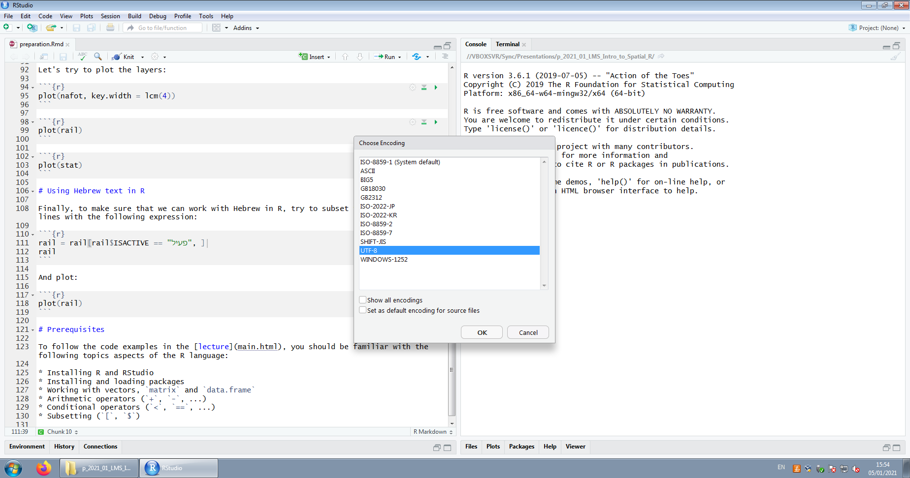

```{r, include=FALSE}
knitr::opts_chunk$set(cache = FALSE, echo = TRUE, collapse = TRUE, fig.align = "center")
# knitr::purl("preparation.Rmd", documentation = 1)
```

# Introduction

This is an exercise and checklist to make sure that your system is correctly set up for the [Using R for Spatial Data Analysis](main.html) lecture. 

A script with the R code of this document is available here:

https://github.com/michaeldorman/R-Spatial-Workshop-at-CBS-2021/raw/main/preparation.R

The Rmarkdown file is available here:

https://github.com/michaeldorman/R-Spatial-Workshop-at-CBS-2021/raw/main/preparation.Rmd

All of the materials are also available on [GitHub](https://github.com/michaeldorman/R-Spatial-Workshop-at-CBS-2021/).

# Setting up R environemnt

To setup the R environment:

* Install R
* Install RStudio
* In R, install the `sf` package:

```{r, eval=FALSE}
install.packages("sf")
```

You should now be able to load the `sf` package as follows:

```{r, message=TRUE, warning=TRUE}
library(sf)
```

# Sample data {-}

Now, download the ZIP file with sample data from:

https://github.com/michaeldorman/R-Spatial-Workshop-at-CBS-2021/raw/main/data.zip

The file contains two Shapefiles and one Geodatabase (Table \@ref(tab:sample-data)). 

| Data | File(s) | Format | Source | 
|----|----|----|------|
| "Nafot"           | `nafot.shp` (+7)                      | Shapefile | https://www.gov.il/he/Departments/Guides/info-gis |
| Railways          | `RAIL_STRATEGIC.shp` (+7)             | Shapefile | https://data.gov.il/dataset/rail_strategic | 
| Statistical areas | `statisticalareas_demography2018.gdb` | GDB       | https://www.cbs.gov.il/he/Pages/geo-layers.aspx |

Table: (\#tab:sample-data) Sample data

Extract the contents of the ZIP file and set the working directory to that location using an expression such as (use your own path):

```{r, eval=FALSE}
setwd("C:\\Data\\CSB")
```

Alternatively, run the following expressions to automatically download and unzip the sample data into your current working directory:

```{r}
url = "https://github.com/michaeldorman/R-Spatial-Workshop-at-CBS-2021/raw/main/data.zip"
download.file(url, "data.zip")
unzip("data.zip")
```

# Reading the layers

If all worked well, the following expressions will import the three layers into R. 

Note that the file names are prefixed with `data/` when the layers are in a sub-directory named `data`, inside the working directory.

```{r}
nafot = st_read("data/nafot.shp")
```

```{r}
rail = st_read("data/RAIL_STRATEGIC.shp", options = "ENCODING=UTF-8")
```

```{r}
stat = st_read("data/statisticalareas_demography2018.gdb", options = "ENCODING=UTF-8")
```

If the files are in the working directory, use just the file name, as follows:

```{r, eval=FALSE}
nafot = st_read("nafot.shp")
rail = st_read("RAIL_STRATEGIC.shp")
stat = st_read("statisticalareas_demography2018.gdb")
```

# Plotting the layers

Let's try to plot the layers (Figures \@ref(fig:nafot), \@ref(fig:rail), and \@ref(fig:stat)):

```{r nafot, fig.cap='The `nafot` layer'}
plot(nafot, key.width = lcm(4))
```

```{r rail, fig.cap='The `rail` layer', fig.width=6, fig.height=4, out.width="100%"}
plot(rail)
```

```{r stat, fig.cap='The `stat` layer'}
plot(stat)
```

# Using Hebrew text in R

Finally, to make sure that we can work with Hebrew in R, try to subset the *active* railway lines with the following expression:

```{r}
rail = rail[rail$ISACTIVE == "פעיל", ]
```

and then plot the subset (Figure \@ref(fig:rail2)):

```{r rail2, fig.cap='The `rail` layer, subset of active railway lines', fig.width=7, fig.height=3, out.width="100%"}
plot(rail)
```

In case you are working with the [R script file](https://github.com/michaeldorman/R-Spatial-Workshop-at-CBS-2021/raw/main/preparation.R) or the [Rmarkdown file](https://github.com/michaeldorman/R-Spatial-Workshop-at-CBS-2021/raw/main/preparation.Rmd), to properly display the Hebrew text the file needs to be opened with the UTF-8 encoding. To do that:

* Open the file in RStudio, by double-click or through **File→Open File...**
* Click on **File→Reopen with Encoding**
* Select **UTF-8** from the list, and click **OK** (Figure \@ref(fig:encoding))

```{r encoding, echo=FALSE, fig.cap="Reopening an R script with the UTF-8 encoding in RStudio", out.width="100%"}

```

# Prerequisites

To follow the code examples in the [lecture](main.html), you should be familiar with the following topics and aspects of the R language:

* Installing R and RStudio
* Installing and loading packages
* Working with vectors, `matrix` and `data.frame`
* Arithmetic operators (`+`, `-`, ...)
* Conditional operators (`<`, `==`, ...)
* Subsetting (`[`, `$`)

